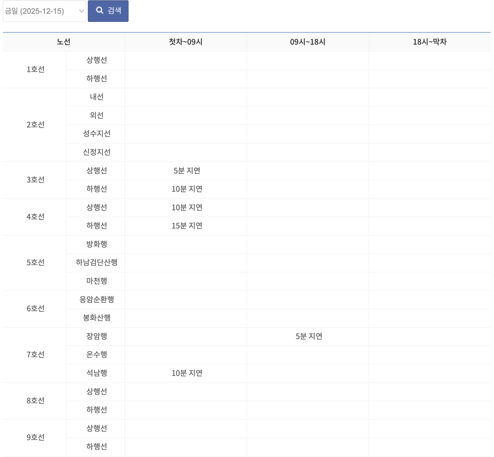
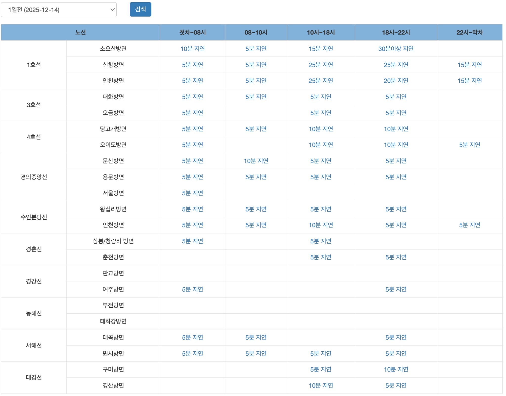
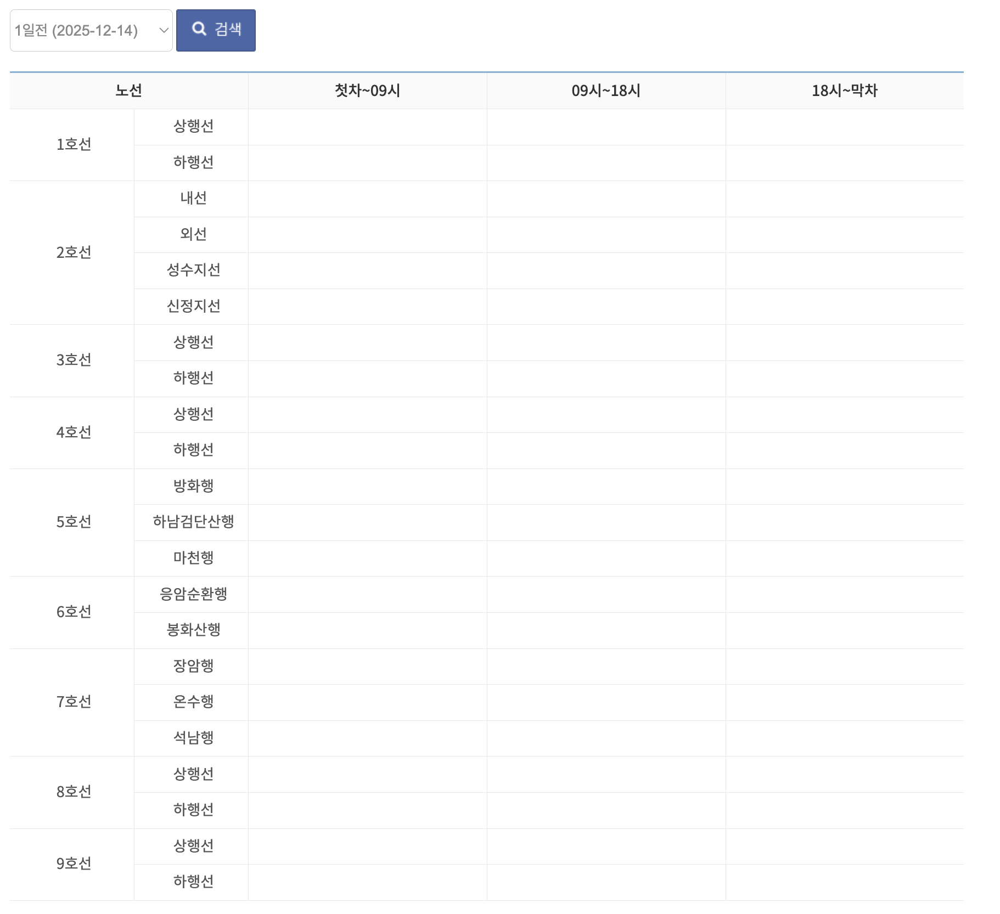
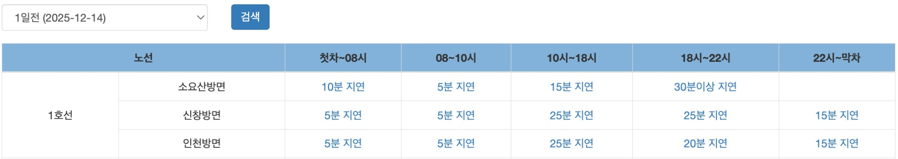
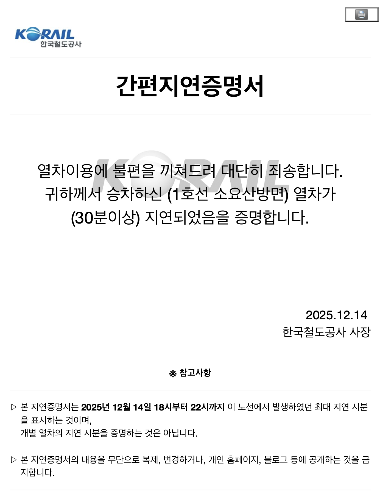
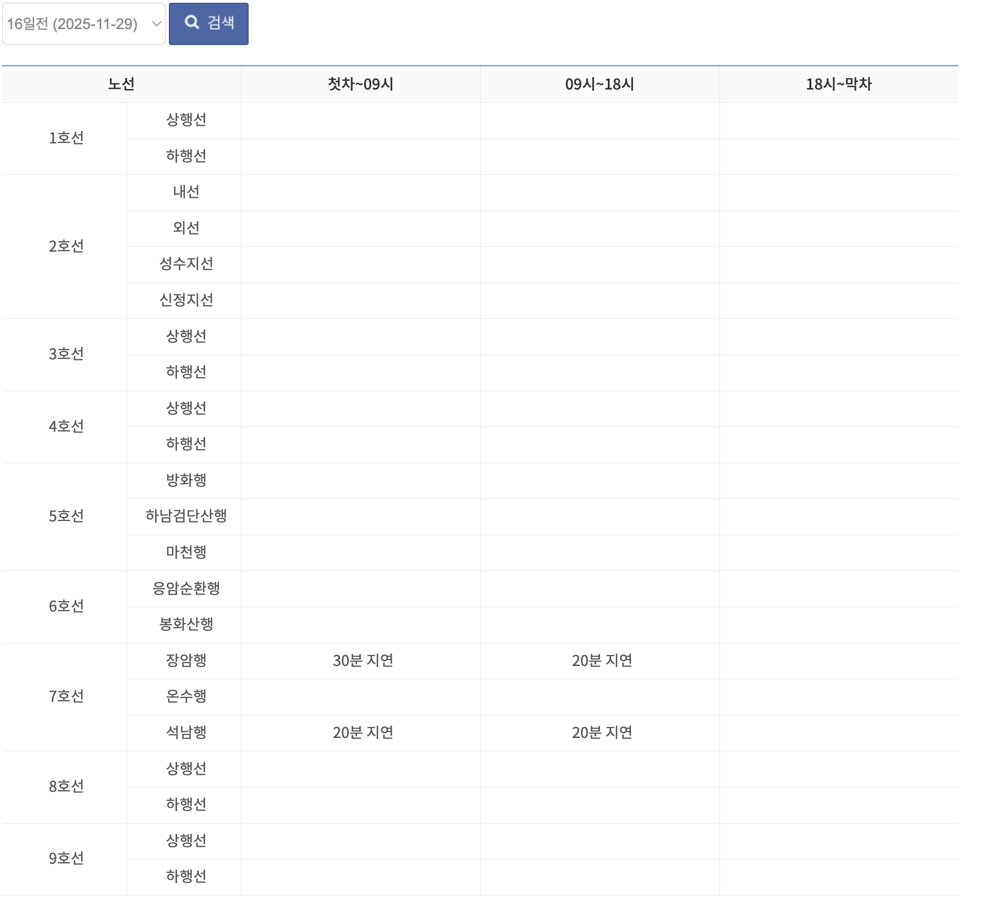

> 더즌(DOZN) 스크래핑 개발팀 채용 과제

## 프로젝트 설명

서울교통공사 및 코레일의 지하철 간편지연증명서를 스크래핑하여 통합 API 형식으로 제공하는 시스템입니다.
지하철 간편지연증명서 웹사이트를 스크래핑하여 표준화된 형식으로 데이터를 제공합니다.

### 주요 특징 및 구현

- 두 사이트를 동시에 스크래핑하여 응답 시간 최소화
- 타임아웃, 네트워크 오류, 파싱 오류 등 각 상황별 에러 코드 반환
- 단위 테스트 및 통합 테스트 포함

### 스크래핑 대상

- **서울교통공사**: http://www.seoulmetro.co.kr/kr/delayProofList.do
  - 조회 범위: 최대 30일
  - 시간대: 3개 (첫차~09시, 09시~18시, 18시~막차)

- **코레일**: https://info.korail.com/mbs/www/neo/delay/delaylist.jsp
  - 조회 범위: 최대 7일
  - 시간대: 5개 (첫차~08시, 08시~10시, 10시~18시, 18시~22시, 22시~막차)

---

## 주요 기능

### 1. 날짜 범위별 스크래핑

- 오늘 ~ 30일 전까지 조회 가능
- 7일 초과 시 코레일 제외 (부분 성공으로 처리)
- 31일 이상 요청 시 에러 반환

### 2. 최소 지연시간 필터링

- 기본값: 30분

### 3. PDF 생성 기능 (선택)

- `pdfDataYn="1"` 설정 시 각 지연 정보에 대한 PDF를 생성하여 Base64로 인코딩
- Puppeteer를 사용하여 웹사이트의 지연증명서 HTML 페이지를 PDF로 변환
- **처리 방식**:
  - 스크래핑된 데이터에서 각 항목의 `pdfUrl`을 추출
  - HTML 페이지의 모든 외부 리소스(이미지, CSS, 폰트) 로드
  - PDF 생성 후, Base64 인코딩하여 `pdfBase64` 필드에 저장
- **필드 처리**:
  - `pdfDataYn="0"`: `pdfBase64` 필드가 응답에 포함되지 않음
  - `pdfDataYn="1"`:
    - PDF 다운로드 성공 시: `pdfBase64` 필드에 Base64 문자열 저장
    - PDF 다운로드 실패 시: `pdfBase64` 필드에 빈 문자열(`""`) 저장 및 로그 출력
- **복원 방법**: `scripts/restore-pdf.js` 스크립트를 사용하여 JSON 출력에서 PDF 추출 및 복원 가능
  - 사용법:
    ```bash
    # scripts/temp.json에서 추출 (기본값)
    node scripts/restore-pdf.js
    
    # 특정 JSON 파일에서 추출
    node scripts/restore-pdf.js <json_file_path>
    ```
  - 주의사항:
    - JSON 파일의 `out.data.ch2.data.dataArray[0].pdfBase64` 필드에서 PDF 데이터를 추출
    - `pdfBase64` 필드가 있는 JSON 파일만 사용 가능합니다
    - 복원된 PDF 파일은 `output/` 디렉토리에 저장됩니다

### 4. 부분 성공 처리

- **7일 초과**: 코레일 조회 범위 초과로 서울교통공사만 조회 (응답 코드: 1000206)
- **타임아웃/네트워크/파싱 에러**: 한 사이트라도 타임아웃, 네트워크, 또는 파싱 에러 발생 시 즉시 전체 실패 처리

---

## 디렉토리 구조

```
03_subway-delay-scraper/
│
├── src/
│   ├── index.ts
│   │
│   ├── services/
│   │   └── delay-scraper-service.ts  # 지연증명서 스크래핑 서비스
│   │
│   ├── scrapers/
│   │   ├── base-scraper.ts           # 기본 스크래퍼 추상 클래스
│   │   ├── seoul-metro-scraper.ts    # 서울교통공사 스크래퍼
│   │   └── korail-scraper.ts         # 코레일 스크래퍼
│   │
│   ├── utils/
│   │   ├── input-validator.ts        # 입력 검증
│   │   ├── data-normalizer.ts        # 데이터 정규화
│   │   ├── response-formatters.ts    # 응답 포맷팅
│   │   ├── pdf-downloader.ts         # PDF 다운로드
│   │   ├── date-converter.ts         # 날짜 변환
│   │   └── time-range-mapper.ts      # 시간대 매핑
│   │
│   ├── config/
│   │   ├── error-codes.ts            # 에러 코드 정의
│   │   ├── error-types.ts            # 에러 타입 정의
│   │   ├── http-config.ts            # HTTP 설정
│   │   └── time-range-mappings.ts     # 시간대 매핑 설정
│   │
│   └── types/
│       └── index.ts                  # 타입 인터페이스
│
├── __tests__/
│   ├── unit/                         # 단위 테스트
│   │   ├── input-validator.test.ts
│   │   ├── delay-scraper-service.test.ts
│   │   ├── seoul-metro-scraper.test.ts
│   │   └── korail-scraper.test.ts
│   │
│   └── integration/                  # 통합 테스트
│       └── delay-scraper-service.integration.test.ts
│
├── scripts/
│   └── restore-pdf.js                # PDF 추출/복원 스크립트
│
├── dist/
├── output/                           # 출력 파일 (PDF 등)
├── package.json
├── tsconfig.json
└── jest.config.js
```

## 환경설정 및 주요 의존성 패키지

- Node.js v18.x (18.0.0 이상, 19.0.0 미만)

### 런타임 의존성

| 패키지 | 버전 | 용도 |
|--------|------|------|
| **axios** | ^1.6.2 | HTTP 클라이언트 |
| **cheerio** | 1.0.0-rc.12 | HTML 파싱 |
| **date-fns** | ^2.30.0 | 날짜 처리 |
| **puppeteer** | ^20.9.0 | PDF 생성(HTML 변환) |

### 개발 의존성

| 패키지 | 버전 | 용도 |
|--------|------|------|
| **typescript** | ^5.3.3 | TypeScript 컴파일러 |
| **@types/node** | ^18.19.0 | Node.js 타입 정의 |
| **jest** | ^29.7.0 | 테스트 프레임워크 |
| **ts-jest** | ^29.1.1 | Jest-TypeScript 통합 |
| **ts-node** | ^10.9.2 | TypeScript 직접 실행 |

## 설치 및 실행

### 1. 의존성 설치
```bash
npm install
```
### 2. 빌드

```bash
npm run build
```


### 3. 테스트

#### 전체 테스트 실행

```bash
npm test
```

#### 개별 유닛 테스트 실행

```bash
# 특정 테스트 파일만 실행
npm test -- input-validator.test.ts
npm test -- delay-scraper-service.test.ts
npm test -- seoul-metro-scraper.test.ts
```

#### 통합 테스트 실행 (실제 HTTP 호출)

```bash
npm test -- --testPathPattern=integration
```

### 4. 개발 모드 실행

```bash
npm run dev
```

## 사용 예시

### 기본 사용법

#### 방법 1: 터미널에서 JSON 파일로 실행

```bash
# 빌드 후 실행
npm run build
node dist/index.js input.json
```

또는 stdin 사용:

```bash
cat input.json | node dist/index.js
```
---

### input.json 예시

#### 예시 1: 기본 사용 (정상 성공)

**Input:**
```json
{
  "in": {
    "ch2": {
      "inqrDate": "20251214",
      "delayTime": "30",
      "pdfDataYn": "0"
    }
  }
}
```

**Output:**
```json
{
  "out": {
    "code": "1000200",
    "msg": "자동연동 성공",
    "data": {
      "ch2": {
        "code": "1000200",
        "msg": "자동연동 성공",
        "data": {
          "dataArray": [
            {
              "line": "1호선",
              "direction": "소요산방면",
              "timeRange": "18시~22시",
              "delayDate": "251214",
              "delayStart": "202512141800",
              "delayEnd": "202512142200",
              "delayTime": "30"
            }
          ]
        }
      }
    }
  }
}
```


---

#### 예시 2: 오늘 날짜 조회 (기본값 사용)

**Input:**
```json
{
  "in": {
    "ch2": {
      "pdfDataYn": "0"
    }
  }
}
```

**Output:**
```json
{
  "out": {
    "code": "1000204",
    "msg": "자동연동 성공(내용 없음)",
    "data": {
      "ch2": {
        "code": "1000204",
        "msg": "자동연동 성공(내용 없음)",
        "data": {
          "dataArray": []
        }
      }
    }
  }
}
```

> **참고**: 오늘 날짜(2025-12-15) 기준으로 30분 이상 지연이 없어서 `dataArray`가 비어있고 응답 코드는 "1000204" (자동연동 성공(내용 없음))로 반환.

**서울교통공사 사이트 (2025-12-15):**


**코레일 사이트 (2025-12-15):**


---

#### 예시 3: 특정 날짜 조회 (5분 이상 지연)

**Input:**
```json
{
  "in": {
    "ch2": {
      "inqrDate": "20251214",
      "delayTime": "5",
      "pdfDataYn": "0"
    }
  }
}
```

**Output:**
```json
{
  "out": {
    "code": "1000200",
    "msg": "자동연동 성공",
    "data": {
      "ch2": {
        "code": "1000200",
        "msg": "자동연동 성공",
        "data": {
          "dataArray": [
            {
              "line": "1호선",
              "direction": "소요산방면",
              "timeRange": "첫차~08시",
              "delayDate": "251214",
              "delayStart": "202512140400",
              "delayEnd": "202512140800",
              "delayTime": "10"
            },
            {
              "line": "1호선",
              "direction": "소요산방면",
              "timeRange": "08시~10시",
              "delayDate": "251214",
              "delayStart": "202512140800",
              "delayEnd": "202512141000",
              "delayTime": "5"
            },
            {
              "line": "1호선",
              "direction": "소요산방면",
              "timeRange": "10시~18시",
              "delayDate": "251214",
              "delayStart": "202512141000",
              "delayEnd": "202512141800",
              "delayTime": "15"
            },
            {
              "line": "1호선",
              "direction": "소요산방면",
              "timeRange": "18시~22시",
              "delayDate": "251214",
              "delayStart": "202512141800",
              "delayEnd": "202512142200",
              "delayTime": "30"
            },
            {
              "line": "1호선",
              "direction": "신창방면",
              "timeRange": "첫차~08시",
              "delayDate": "251214",
              "delayStart": "202512140400",
              "delayEnd": "202512140800",
              "delayTime": "5"
            }
          ]
        }
      }
    }
  }
}
```

> **참고**: 실제 응답에는 총 64건의 데이터가 포함됩니다. 위는 일부만 표시한 예시입니다.

**코레일 사이트 (2025-12-14, 5분 이상 지연):**


**서울교통공사 사이트 (2025-12-14):**


---

#### 예시 4: PDF 생성 포함

**Input:**
```json
{
  "in": {
    "ch2": {
      "inqrDate": "20251214",
      "delayTime": "30",
      "pdfDataYn": "1"
    }
  }
}
```

**Output:**
```json
{
  "out": {
    "code": "1000200",
    "msg": "자동연동 성공",
    "data": {
      "ch2": {
        "code": "1000200",
        "msg": "자동연동 성공",
        "data": {
          "dataArray": [
            {
              "line": "1호선",
              "direction": "소요산방면",
              "timeRange": "18시~22시",
              "delayDate": "251214",
              "delayStart": "202512141800",
              "delayEnd": "202512142200",
              "delayTime": "30",
              "pdfBase64": "JVBERi0xLjQKJeLjz9MKMy..."
            }
          ]
        }
      }
    }
  }
}
```

> **참고**: 
> - 위 예시에서는 `pdfBase64` 값이 길어서 생략(`...`)하여 표시했습니다. 실제 응답에는 전체 PDF Base64 문자열이 포함됩니다.
> - PDF 다운로드가 실패한 경우 `pdfBase64` 필드에 빈 문자열(`""`)이 저장되며, 로그에 실패 정보가 기록됩니다.

**코레일 사이트 지연 정보 (2025-12-14):**


**복원된 PDF 지연증명서:**


**복원된 PDF 파일 정보:**
- 파일명: `output/restored_output_<timestamp>.pdf`
- 내용: 1호선 소요산방면 18시~22시 시간대 지연증명서

---

#### 예시 5: 부분 성공 (한 사이트만 성공)

**Input:**
```json
{
  "in": {
    "ch2": {
      "inqrDate": "20251129",
      "delayTime": "30",
      "pdfDataYn": "0"
    }
  }
}
```

**Output:**
```json
{
  "out": {
    "code": "1000206",
    "msg": "자동연동 성공(부분 성공)",
    "data": {
      "ch2": {
        "code": "1000206",
        "msg": "자동연동 성공(부분 성공)",
        "data": {
          "dataArray": [
            {
              "line": "7호선",
              "direction": "장암행",
              "timeRange": "첫차~09시",
              "delayDate": "251129",
              "delayStart": "202511290400",
              "delayEnd": "202511290900",
              "delayTime": "30"
            }
          ]
        }
      }
    }
  }
}
```

> **참고**: 16일 전 날짜(2025-11-29)는 코레일 조회 범위(7일)를 초과하므로 코레일은 자동으로 제외되고 서울교통공사만 조회됩니다. 이 경우는 부분 성공으로 처리되어 응답 코드는 "1000206" (자동연동 성공(부분 성공))입니다.

**서울교통공사 사이트 (2025-11-29, 16일 전):**


---

#### 예시 6: 에러 케이스 (미래 날짜)
> **참고**: 
> - 자세한 에러 케이스 처리는 API 명세서 마지막 부분에 첨부하였습니다.

```json
{
  "in": {
    "ch2": {
      "inqrDate": "20251231",
      "delayTime": "30",
      "pdfDataYn": "0"
    }
  }
}
```

**Output:**
```json
{
  "out": {
    "code": "1000016",
    "msg": "조회 시작/종료일이 오늘보다 미래입니다.",
    "data": {
      "ch2": {
        "code": "1000016",
        "msg": "조회 시작/종료일이 오늘보다 미래입니다.",
        "data": {
          "dataArray": []
        }
      }
    }
  }
}
```
